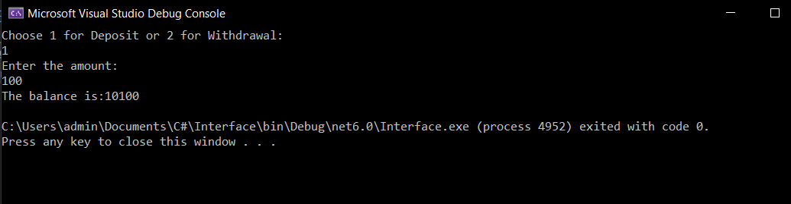
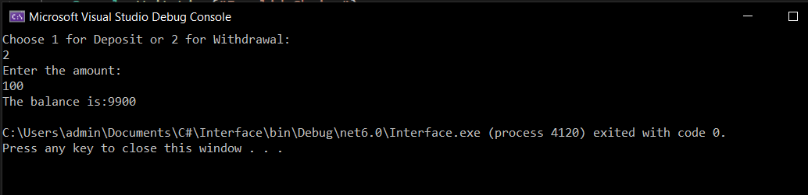

 <h1>Interface </h1> 

## Aim:
To Develop a small bank application by declaring deposit() and withdrawal() as abstract methods in the interface. Get the choice from the user whether to perform withdrawal or deposit operation. After the operation completes, display the balance amount.
## Algorithm:
### Step 1: 
Create an interface.

### Step 2: 
Create a child class.

### Step 3: 
Declare 2 functions deposit() and withdrawal() as abstract methods in the interface.

### Step 4: 
Create those 2 functions in the child class and perform respective operation.

### Step 5: 
Use if-else conditional statement to get the choice from the user whether to perform withdrawal or deposit operation.

### Step 6: 
After performing the functions display the remaining balance of the user.

## Program:
```
Developed by : Paul Andrew D
Register no : 212221230075
```
```c#
using System;
public interface Bank
{
    void deposit(int amount);
    void withdrawal(int amount);
}
class program : Bank
{
    int bal = 10000;
    public void deposit(int amount)
    {
        bal += amount;
        Console.WriteLine("The balance is:" + bal);
    }
    public void withdrawal(int amount)
    {
        bal -= amount;
        Console.WriteLine("The balance is:" + bal);
    }
}
class program1
{
    public static void Main()
    {
        program obj1 = new program();
        program obj2 = new program();
        int choice, amount;
        Console.WriteLine("Choose 1 for Deposit or 2 for Withdrawal:");
        choice = Convert.ToInt32(Console.ReadLine());
        if (choice == 1)
        {

            Console.WriteLine("Enter the amount:");
            amount = Convert.ToInt32(Console.ReadLine());
            obj1.deposit(amount);
        }
        else if (choice == 2)
        {
            Console.WriteLine("Enter the amount:");
            amount = Convert.ToInt32(Console.ReadLine());
            obj2.withdrawal(amount);
        }
        else
        {
            Console.WriteLine("Invalid Choice");
        }
    }
}
```
## Output:
## Deposit


## Withdrawal:

## Result:
Thus, a C# program was developed for a bank application using interface.